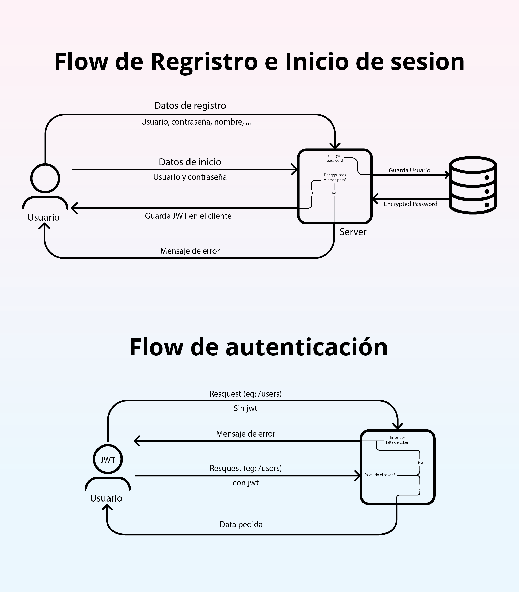

<p align="center">
  <a href="core.jaimendo.online" rel="noopener">
</p>

<h3 align="center">TALIBOX</h3>


---

<p align="center"> A Web Development Project for UDLA's Web Development Course
    <br> 
    You can see the project live at <a href="https://core.jaimendo.online">core.jaimendo.online</a>
</p>

## 📝 Table of Contents

- [About](#about)
- [Getting Started](#getting_started)
- [Deployment](#deployment)
- [Usage](#usage)
- [Built Using](#built_using)

## 🧐 About <a name = "about"></a>

Talibox is a web app that helps you track box office movies, it has a simple interface that allows you to see the latest movies, search for movies, and see the details of each movie. It also has an admin interface that allows you to add, edit, and delete movies. 

## 🏁 Getting Started <a name = "getting_started"></a>

This project uses the [GOTTH Stack](https://github.com/arejula27/goth-stack), which is:
- [Go Lang](https://golang.org/) as the backend
- [Echo](https://echo.labstack.com/) as the web framework
- [Templ](https://templ.guide/) as the template engine
- [TailwindCSS](https://tailwindcss.com/) for staying with tailwindUI
- [HTMX](https://htmx.org/) for the frontend magic

These instructions will get you a copy of the project up and running on your local machine for development and testing purposes. See [deployment](#deployment) for notes on how to deploy the project on a live system.

### Prerequisites

You will need to have 
[Go Lang](https://golang.org/) installed on your machine, follow the instructions on the website.
#### [Air:](https://github.com/cosmtrek/air) hot reload for Go

Air must be in path, you can install it by running the following command:
```bash
go install github.com/cosmtrek/air@latest
```
#### [Templ:](https://templ.guide/) template engine for Go
Templ must also be in PATH, you can install it by running the following command:
```bash
go install github.com/a-h/templ/cmd/templ@latest
```
#### [Echo](https://echo.labstack.com/) web framework for Go
Echo is a go module, you can install it by running the following commands:
```bash
go get github.com/labstack/echo/v4
go get github.com/labstack/echo/v4/middleware
go get github.com/labstack/echo-jwt/v4
```


## Auth System
The auth system is based on JWT, you will need to create a .env file in the root of the project with the following variables:
```bash
JWT_SECRET
```
#### Diagram



### Installing

The best way to self host this app is by using the dockerfile provided in the project, you can build the image by running the following command:

Clone the project
```bash
git clone Jaimendo99/talibox
```
Build the image
```bash
docker build -t talibox .
```
Run the image
```bash
docker run -p 8080:8080 talibox
```
